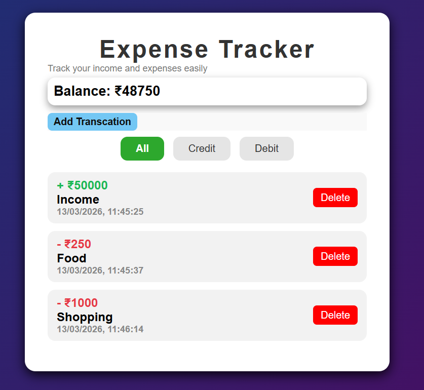
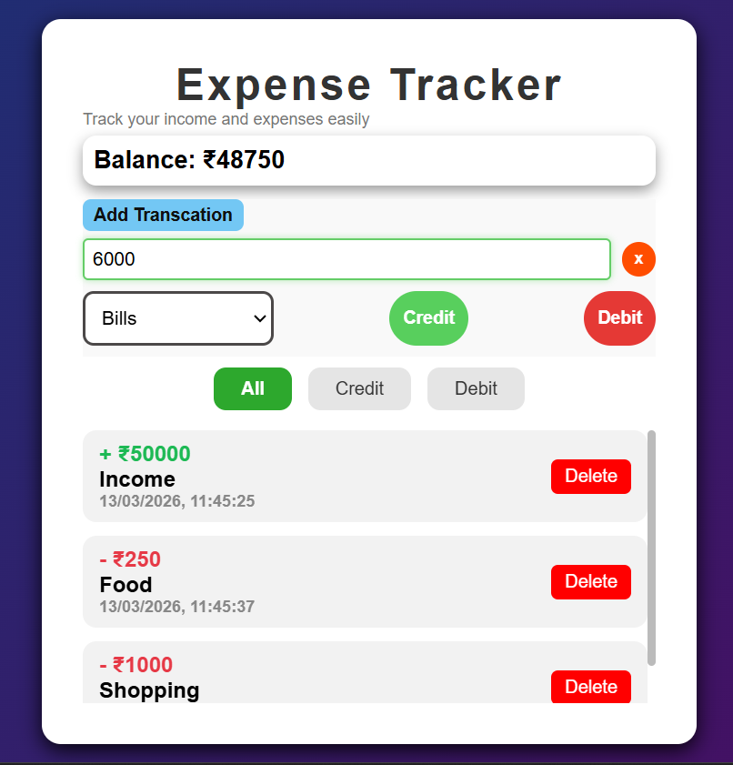
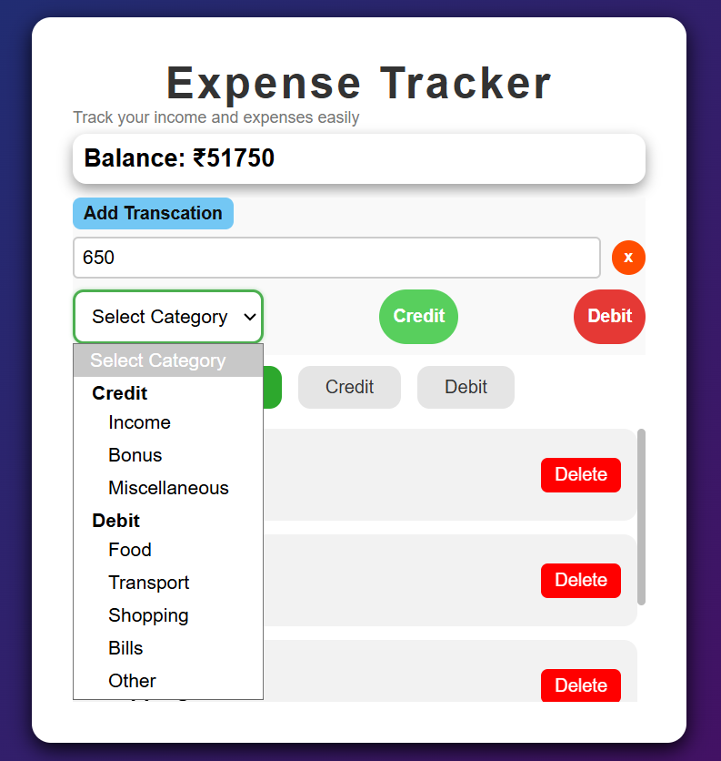
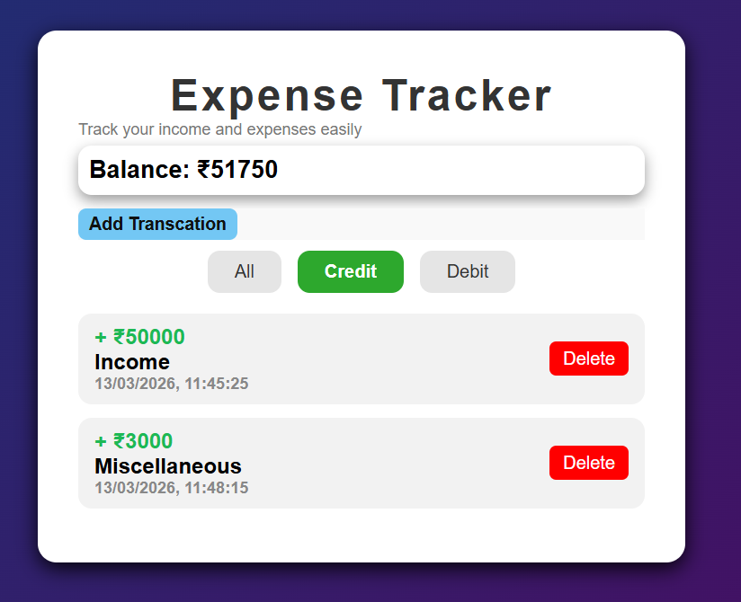

# 💰 Expense Tracker
## By Mehar Surati and Harman Singh

A simple and interactive **Expense Tracker Web App** built using **HTML, CSS, and JavaScript**.  
It helps users track their **credits and debits**, categorize transactions, and view their **current balance**.
The app stores data in **LocalStorage**, so transactions remain saved even after refreshing the page.

---

## 🚀 Features

- ➕ Add Credit or Debit transactions  
- 🗂 Categorize transactions  
- 📅 Automatically stores date and time  
- 🔎 Filter transactions (All / Credit / Debit)  
- 🧮 Automatic balance calculation  
- 💾 Persistent data using LocalStorage  
- 🗑 Delete transactions  
- 🎨 Clean and responsive UI with animations  

---

## 🛠 Tech Stack

- **HTML5** – Structure of the application  
- **CSS3** – Styling and layout  
- **JavaScript** – Logic and dynamic functionality  
- **LocalStorage API** – Storing transaction data in the browser  

---

## ⚙️ How to Run the Project

1. Clone the repository
   
   git clone https://github.com/meharsurati25/Expense-Tracker.git

2. Open the project folder

   cd expense-tracker

3. Run the project

   Open **index.html** in your browser.

---

## Preview

### Main UI

### Add Transaction

### Categories

### Filtering Options

